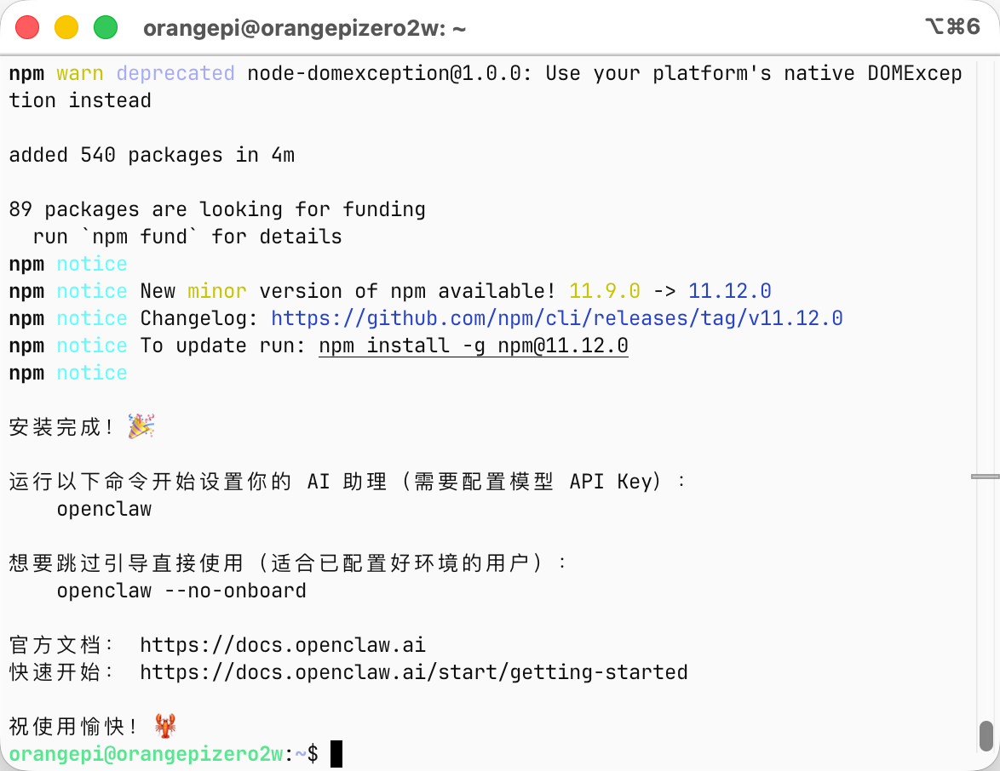

# Orange Pi OneKey Install OpenClaw

[English](#english) | [中文](#中文)

---

## English

### One-click installer for OpenClaw on Linux (Orange Pi)

A simple shell script to install [OpenClaw](https://github.com/openclaw/openclaw) on Linux devices (tested on Orange Pi).

**OpenClaw** — Your personal local AI assistant.

### Features

- Auto-installs Node.js 24 via nvm (requires ≥22.16)
- Auto-detects existing OpenClaw installation
- Supports upgrade via interactive prompt

### Usage

```bash
chmod +x install_openclaw.sh
./install_openclaw.sh
```



### Requirements

- Linux (tested on Orange Pi)
- curl
- ~5 minutes

### Quick Start

After installation:

```bash
openclaw
```

Skip the onboarding wizard (if already configured):

```bash
openclaw --no-onboard
```

### Docs

- Official docs: https://docs.openclaw.ai
- Quick start: https://docs.openclaw.ai/start/getting-started

---

## 中文

### Orange Pi 一键安装 OpenClaw

在 Linux 设备（Orange Pi）上安装 [OpenClaw](https://github.com/openclaw/openclaw) 的简易脚本。

**OpenClaw** — 个人本地 AI 助理。

### 功能

- 通过 nvm 自动安装 Node.js 24（需要 ≥22.16）
- 自动检测已安装的 OpenClaw 版本
- 支持交互式升级

### 使用方法

```bash
chmod +x install_openclaw.sh
./install_openclaw.sh
```


### 环境要求

- Linux（已在 Orange Pi 上测试）
- curl
- 约 5 分钟

### 快速开始

安装完成后：

```bash
openclaw
```

跳过引导配置（适用于已配置好的环境）：

```bash
openclaw --no-onboard
```

### 相关链接

- 官方文档：https://docs.openclaw.ai
- 快速入门：https://docs.openclaw.ai/start/getting-started
